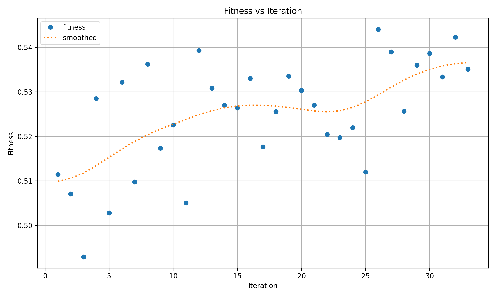

# Проект 1 по предмету глубокое обучение на практике - Распознавание и классификация дорожных знаков, Команда 10
## Пример работы приложения
**TODO**
## Локальный запуск приложения
1. Установить библиотеку **Streamlit** согласно [официальной инструкции по установке](https://docs.streamlit.io/library/get-started/installation).
2. Установить дополнительные зависимости:
```
pip install -r requirements.txt
```
3. Запустить приложение из корня репозитория
```
streamlit run app.py
```
## Описание предложенного решения
### Формализация задачи
**Задача**: создать прототип системы распознавания и классификации дорожных знаков в режиме реального времени по видео.
**Требования к решению**:
- Большое количество распознаваемых классов, включающее отдельные классы для знаков ограничения скорости
- Работа в различных условиях освещения и погоды

### Описание выбранного датасета
Для обучения моделей был взят публичный датасет для распознавания и классификации шведских дорожных знаков. [Ссылка](https://www.cvl.isy.liu.se/research/datasets/traffic-signs-dataset/).
- 20 различных классов, включающих ограничения скорости
- около 2000 размеченных кадров из видеозаписей с автомобильных видеорегистраторов, после предобработки

Для обработки исходного датасета использовались скрипты, расположенные в папке [data_preprocessing](data_prepocessing).

### Формулировка задачи в ML-терминах
**Метрики**:
- mAP
- Average Recall
- Собственная метрика, используемая в YOLO (комбинация различных mAP). [Подробнее](https://docs.ultralytics.com/yolov5/tutorials/hyperparameter_evolution/#2-define-fitness).

**Архитектуры**:
- YOLOv5
- YOLOv8

### Сравнение моделей
| Модель       | mAP_0.5| mAP_0.5:0.95 |
| ------------- |:------------------:| -----:|
| YOLOv5     | 0.71    | 0.48 |
| YOLOv8     | 0.83 |   0.55 |

По результатам сравнения была выбрана **YOLOv8**

### Поиск гиперпараметров для YOLOv8
Поиск гиперпараметров осуществлялся по метрике [fitness](https://docs.ultralytics.com/yolov5/tutorials/hyperparameter_evolution/#2-define-fitness). Описание гиперпараметров находится в [официальной документации](https://docs.ultralytics.com/yolov5/tutorials/hyperparameter_evolution/#1-initialize-hyperparameters). Для поиска использовались скрипты, расположенные в [hypersearch](hypersearch), все запуски логировались в проект ClearML. Значения лучших найденных гиперпараметры можно найти [тут](hypersearch/runs/detect/tune3/best_hyperparameters.yaml).
График целевой метрики на различных итерациях поиска:


## Состав команды:
- Шухман Арина Викторовна
- Капустина Елизавета Игоревна
- Казанцев Даниил Андреевич
- Кочерин Никита Алексеевич
- Кудряшов Георгий Александрович
